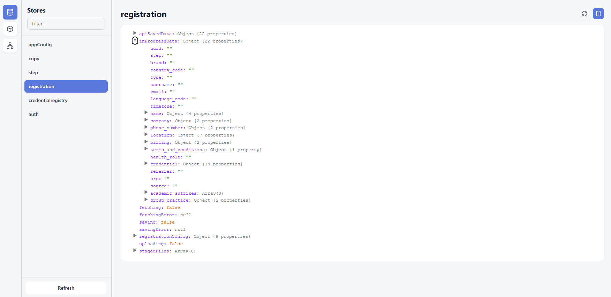
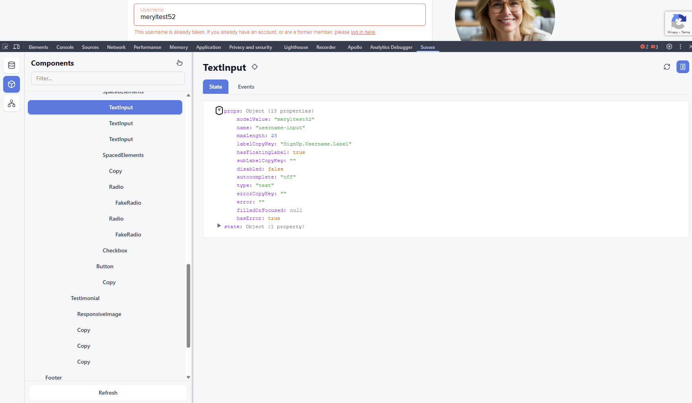
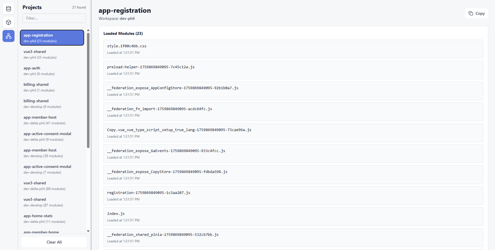

# Sussex DevTools

A Chrome extension to inspect the inner workings of our federated module system architecture.

## Features

### Pinia Store Browser
View and inspect Pinia stores in real-time with auto-refresh and an interactive JSON tree.



### Component Inspector
Browse the component tree, inspect props and state, and emit events to components for testing.



### Member Modules Monitor
Track member module network requests and see which projects are loaded from which workspaces.



## Installation

### For Users

1. Go to the [Releases page](../../releases) on GitLab
2. Download the latest `sussex-devtools.zip` file
3. Extract the zip file to a folder on your computer
4. Open Chrome and go to `chrome://extensions/`
5. Enable "Developer mode" (top right toggle)
6. Click "Load unpacked"
7. Select the extracted folder
8. Open DevTools (F12) and look for the "Sussex" panel

### For Developers

This Chrome DevTools extension is built with Vue 3 + Tailwind CSS + Vite.

**Prerequisites:**
- Node.js (v22 or higher recommended)
- npm

**Setup:**
```bash
npm install
npm run build
```

**Development:**
- Make your changes and rebuild with `npm run build`
- Load the extension from the `dist` directory

## Contributing

Built with Vue 3, Tailwind CSS, and Vite. Contributions welcome!
